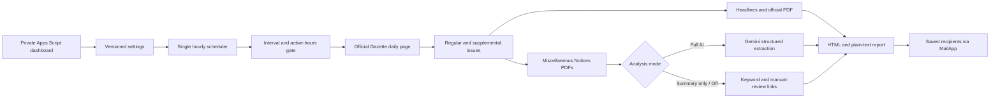

# Turkish Official Gazette Academic Alerts

[](https://github.com/yberkayinci/turkish-official-gazette-academic-alerts/actions/workflows/test.yml)
[](LICENSE)
[](https://script.google.com/)

A private, serverless monitoring workspace for academic recruitment notices in Türkiye's Official Gazette. It discovers regular and supplemental issues, optionally uses Gemini to extract research-assistant vacancies, and sends configurable email alerts.

Version 2 adds a polished web dashboard, optional AI, flexible scheduling, multiple recipients, relevance filters, activity history, and safe maintenance controls.

## Product boundary

This repository is a **self-hosted, single-tenant Apps Script application**. Each user deploys a private copy under their own Google account and owns their own configuration, Gemini key, email quota, and triggers.

It must be deployed with:

- **Execute as:** Me
- **Who has access:** Only myself

Do not expose this version as an anonymous or shared multi-user web app. A centralized commercial SaaS requires separate identity, database, secrets, billing, and scheduler infrastructure. See [Commercial architecture](docs/COMMERCIALIZATION.md).

## Dashboard capabilities

- Private, responsive setup and operations dashboard.
- Primary recipient plus two optional additional recipients delivered by BCC for address privacy.
- Custom sender name and delivery policy.
- Monitoring every 1, 2, 3, 4, 6, 8, 12, or 24 hours.
- Configurable active-hours window in `Europe/Istanbul`.
- Pause/resume monitoring without deleting configuration.
- Previous-day backfill and supplemental-issue controls.
- Three analysis modes:

  | Mode | Gemini key | Headline summary | PDF vacancy extraction |
  | --- | --- | --- | --- |
  | Full AI | Required | Optional | Yes |
  | Summary only | Required | Yes | No; candidate links require review |
  | Keyword mode | Not required | Deterministic | No; likely academic links require review |

- Required/excluded keyword and preferred-institution filters.
- Correction, cancellation, uncertainty, and headline preferences.
- Test email and Gemini connection actions.
- Remaining email quota, scheduler health, last-run summary, and recent activity.
- Explicit controls for cache, processed history, scheduler repair, and API-key removal.

## Monitoring capabilities

- Verifies the requested date and exact PDF filename to reject the Official Gazette website's silent date fallback.
- Discovers the regular issue and every supplemental issue listed on the official daily page.
- Prioritizes the **Miscellaneous Notices** index before applying the headline limit.
- Reviews all linked notice PDFs in Full AI mode instead of relying only on link-title keywords.
- Uses Gemini structured output to extract institution, unit, department, count, grade, ALES, language requirement, special conditions, deadline, method, evidence, and source page.
- Preserves official source links and never trusts AI-generated URLs.
- Degrades to manual-review links when AI, parsing, quota, document-size, or execution-time limits prevent a reliable result.
- Deduplicates processed issues, caches document analysis, and checks the previous day for late publications.

## Architecture



Secrets remain separate from non-secret preferences:

- `GEMINI_API_KEY`: stored separately and never returned to the browser.
- `RECIPIENT_EMAIL`: legacy-compatible primary recipient property.
- `RG_SETTINGS_V2`: versioned non-secret preferences.
- Runtime state, activity, processed publications, and analysis cache use independent properties.

## Requirements

- A Google account.
- A private Google Apps Script project.
- A Gemini Developer API key only for **Full AI** or **Summary only** mode.

> Google AI Pro and the Gemini Developer API are separate products. An AI Pro subscription does not remove the need for a Developer API key. API usage follows the associated project's free or paid quota. See [Gemini API billing](https://ai.google.dev/gemini-api/docs/billing).

## Quick start

1. Open [Google Apps Script](https://script.google.com/) and create a new project.
2. Add the repository files to the project:

   - `Code.gs`
   - `WebApp.gs`
   - `Index.html` as an HTML file named `Index`
   - `appsscript.json` when using `clasp`

3. Set the project time zone to **(GMT+03:00) Europe/Istanbul**.
4. Choose **Deploy → New deployment → Web app**.
5. Select **Execute as me** and **Only myself**, authorize the requested scopes, and deploy.
6. Open the deployment URL, complete the dashboard, and save.
7. Use **Send test email**, **Test AI connection** when applicable, and **Check now**.

The dashboard creates exactly one hourly scheduler and enforces the chosen interval and active window in code. Apps Script trigger times are approximate.

For a complete production checklist, upgrades, and troubleshooting, read [Deployment guide](docs/DEPLOYMENT.md).

## Backward compatibility

Existing version 1 installations continue to work:

- A stored `RECIPIENT_EMAIL` is imported as the primary recipient.
- A stored `GEMINI_API_KEY` selects Full AI mode; the dashboard verifies it on the first AI-enabled save before marking setup complete.
- Processed-publication state and the existing analysis cache are retained.
- Saving the dashboard replaces the former fixed trigger set with one hourly scheduler.

The legacy `setup()` function remains available, but new installations should use the dashboard.

## Public Apps Script functions

| Function | Purpose |
| --- | --- |
| `doGet` | Serves the private dashboard |
| `getDashboardState` | Returns sanitized settings, health, quota, and activity |
| `saveDashboardSettings` | Validates and saves preferences, optionally verifies a new AI key, and reconciles the scheduler |
| `testRecipientEmail` | Sends a test only to saved recipients |
| `testAiConnection` | Verifies the stored Gemini key |
| `runCheckNow` | Runs an immediate check from the dashboard |
| `repairScheduler` | Reconciles missing or duplicate scheduler triggers |
| `clearProcessedHistory` | Clears deduplication history after explicit confirmation |
| `clearAnalysisCache` | Clears cached AI analyses after explicit confirmation |
| `clearAiKey` | Removes the AI key only while AI is disabled |
| `setup` | Backward-compatible initializer for editor-based installations |
| `scheduledCheck` | Installable-trigger entry point |
| `checkTodayNow` | Editor-based immediate check |
| `resendToday` | Reanalyzes and resends today's issue |
| `showStatus` | Logs a secret-safe operational summary |

## Security and privacy

- Never commit a Gemini key, recipient address, deployment URL, or `.clasp.json`.
- Never deploy this single-tenant version to anonymous or broad access.
- Keep the Apps Script project private and limit editor access. Script Properties are configuration storage, not a dedicated secrets vault; project editors can read them.
- The API key is sent in the `x-goog-api-key` header and is never returned by dashboard endpoints.
- Dashboard values are rendered with safe text operations, not dynamic HTML.
- Server endpoints validate full payloads, reject unknown settings, cap list sizes, and use optimistic revisions to prevent two tabs from silently overwriting each other.
- Email tests can target only saved recipients, preventing the endpoint from becoming an arbitrary mail relay.
- Only `https://www.resmigazete.gov.tr` source links are rendered in reports.
- Official Gazette documents are public. Do not add CVs or personal profiles without reviewing the selected Gemini tier's data-use terms.

Read [SECURITY.md](SECURITY.md) before deployment.

## Reliability and quota behavior

- One hourly trigger remains well below the Apps Script per-user trigger limit.
- Interval gating avoids running the full monitor every hour when a longer interval is selected.
- A global deadline prevents new network calls near the Apps Script execution limit.
- Email quota is checked against the number of recipients, not only the number of messages.
- Full AI mode permits up to 30 candidate documents plus one optional headline-summary request per new issue.
- AI failure creates manual-review entries instead of claiming that no vacancy exists.
- Analysis cache keys include the model and prompt version so incompatible results are not silently reused.

Always confirm current limits in the official [Apps Script quotas](https://developers.google.com/apps-script/guides/services/quotas) and Gemini project **Rate Limits** pages.

Relevant documentation:

- [Apps Script web apps](https://developers.google.com/apps-script/guides/web)
- [HTML Service communication](https://developers.google.com/apps-script/guides/html/communication)
- [Installable triggers](https://developers.google.com/apps-script/guides/triggers/installable)
- [MailApp](https://developers.google.com/apps-script/reference/mail/mail-app)
- [Properties Service](https://developers.google.com/apps-script/reference/properties)
- [Gemini document processing](https://ai.google.dev/gemini-api/docs/document-processing)
- [Gemini API key guidance](https://ai.google.dev/gemini-api/docs/api-key)
- [Gemini API pricing](https://ai.google.dev/gemini-api/docs/pricing)

## Development

Production uses no package dependency or third-party UI CDN. Node.js is required only for local tests.

```bash
npm test
```

The test suite covers:

- Official Gazette parsing and exact-date safety.
- Supplemental-issue discovery.
- Full AI integration, request shape, email output, and deduplication.
- Version 1 migration and versioned dashboard settings.
- Optional-AI keyword mode and secret non-disclosure.
- Recipient restrictions and scheduler reconciliation.
- Dashboard client syntax, required controls, accessibility markers, and unsafe-rendering regressions.

## Disclaimer

This project is an independent alerting aid, not a legal source, official government service, or employment decision system. AI and keyword results can be incomplete or incorrect. Always open the linked official notice and verify requirements, dates, corrections, cancellations, and application instructions before acting.

## Contributing

Contributions are welcome. Read [CONTRIBUTING.md](CONTRIBUTING.md), update tests and documentation, and open a focused pull request.

## License

Licensed under the [MIT License](LICENSE).
