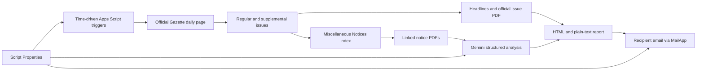

# Turkish Official Gazette Academic Alerts

[](https://github.com/yberkayinci/turkish-official-gazette-academic-alerts/actions/workflows/test.yml)
[](LICENSE)
[](https://script.google.com/)

A serverless Google Apps Script that monitors Türkiye's Official Gazette, finds academic recruitment notices, uses Gemini to identify research-assistant vacancies, and emails a structured daily report.

It is designed for a single user who wants a dependable alert without running a server or storing a Gmail password.

## What it does

- Checks the Official Gazette several times per day in the `Europe/Istanbul` time zone.
- Discovers both the regular issue and every supplemental issue listed for that date.
- Verifies the requested date and exact PDF filename to prevent the Gazette website's date fallback from producing a false match.
- Lists the issue headlines and links to the official PDF.
- Opens the **Miscellaneous Notices** index and reviews its linked PDFs for academic recruitment.
- Uses Gemini structured output to extract research-assistant positions, institutions, units, requirements, deadlines, and evidence.
- Sends an HTML and plain-text email report.
- Deduplicates processed issues and retries when an issue is published late.
- Preserves source links and places uncertain or failed analyses in a prominent manual-review section.

The email is written in English. Official institution names, qualifications, and evidence may remain in Turkish so that legally significant wording is not mistranslated.

## Architecture



## Why Google Apps Script

Apps Script provides scheduled execution, outbound HTTP requests, and email delivery under your Google account. There is no server to deploy and no Gmail password or app password to store. The workload is small enough to fit comfortably within typical Apps Script quotas.

## Requirements

- A Google account.
- A Gemini Developer API key from [Google AI Studio](https://aistudio.google.com/app/apikey).
- Approximately five minutes for initial setup.

> A Google AI Pro subscription and Gemini Developer API usage are separate products. An API key is still required, and API usage follows the project's own free or paid quota. See [Gemini API billing](https://ai.google.dev/gemini-api/docs/billing).

## Setup

1. Open [Google Apps Script](https://script.google.com/) and create a **New project**.
2. Open the default script file and replace its contents with [Code.gs](Code.gs).
3. Open **Project Settings** and set the time zone to **(GMT+03:00) Europe/Istanbul**.
4. Under **Script Properties**, add these two properties:

   | Property | Value |
   | --- | --- |
   | `GEMINI_API_KEY` | A dedicated Gemini Developer API key |
   | `RECIPIENT_EMAIL` | The email address that should receive reports |

5. Select the `setup` function and click **Run**.
6. Review and approve the requested permissions for external requests, sending email, and managing time-driven triggers. If Google shows an unverified-app warning for the Apps Script project you created yourself, continue only after confirming the displayed project name and URL are yours.
7. Select `checkTodayNow` and click **Run** to request the first live report immediately.

No web-app deployment is required. The `setup` function validates the Gemini connection, creates the schedule, and sends a setup confirmation email.

## Schedule and delivery behavior

The default schedule checks at approximately `06:15`, `09:15`, `12:15`, `15:15`, `18:15`, `21:15`, and `23:15` Istanbul time. Apps Script may shift time-driven triggers by several minutes.

Each run checks both today and yesterday. This catches late publications and supplemental issues while processed-publication state prevents duplicate emails. If no issue exists by the final daily check, the app sends a single informational notice.

The full Official Gazette PDF is linked rather than attached, which avoids email attachment limits. Relevant recruitment PDFs are analyzed individually.

## Available functions

| Function | Purpose |
| --- | --- |
| `setup` | Validates configuration, tests Gemini, creates triggers, and sends a confirmation email |
| `checkTodayNow` | Checks today's publications without resending completed issues |
| `resendToday` | Reanalyzes and resends today's publications, bypassing deduplication and cache |
| `refreshTriggers` | Recreates all scheduled checks |
| `removeTriggers` | Removes this project's scheduled checks |
| `showStatus` | Prints a secret-safe configuration and processing summary |
| `scheduledCheck` | Trigger entry point; normally not run manually |

## Reliability safeguards

- Exact issue-date and PDF-basename validation.
- Discovery of supplemental issues from the official daily page instead of guessing their count.
- Broad review of all PDFs in the Miscellaneous Notices index to reduce false negatives.
- Deterministic source URLs; AI-generated URLs are never trusted.
- JSON-schema validation and normalized AI output.
- Manual-review fallback when a document is too large, cannot be downloaded, exceeds the execution budget, or produces uncertain analysis.
- A global run-time budget and a safety buffer before starting new network calls.
- Best-effort, size-aware analysis caching that cannot invalidate an otherwise successful result.
- State retention and script locking to prevent duplicate concurrent delivery.

## Security and privacy

- Never commit `GEMINI_API_KEY` or `RECIPIENT_EMAIL`.
- Keep the Apps Script project private and limit it to one trusted editor. Script Properties are configuration storage, not a dedicated secrets vault; project editors can read them.
- Create a dedicated API key and restrict it to the Gemini API. See [API key best practices](https://ai.google.dev/gemini-api/docs/api-key).
- The API key is sent in the `x-goog-api-key` header, not in a URL.
- Only `https://www.resmigazete.gov.tr` source links are rendered in outgoing email.
- Official Gazette documents are public. If you later add CVs, personal profiles, or private filters, review Gemini's data-use terms first. Google states that free-tier and paid-tier data handling can differ.

See [SECURITY.md](SECURITY.md) for vulnerability reporting.

## Quotas and cost

The app uses Gemini once per candidate document, up to 30 documents per issue, plus one optional headline-summary request. Free-tier availability and rate limits vary by model and project; consult the **Rate Limits** page in Google AI Studio.

Apps Script consumer quotas currently include daily URL Fetch and email-recipient limits as well as a per-execution time limit. The default schedule and run-time guard are designed around those limits. Always confirm the latest values in the official [Apps Script quotas](https://developers.google.com/apps-script/guides/services/quotas) documentation.

Relevant documentation:

- [Installable triggers](https://developers.google.com/apps-script/guides/triggers/installable)
- [MailApp](https://developers.google.com/apps-script/reference/mail/mail-app)
- [Gemini document processing](https://ai.google.dev/gemini-api/docs/document-processing)
- [Gemini models](https://ai.google.dev/gemini-api/docs/models)
- [Gemini API pricing](https://ai.google.dev/gemini-api/docs/pricing)

## Development

The production app has no package dependencies. Node.js is used only to run the local parser and integration tests.

```bash
npm test
```

The integration test runs the Apps Script code inside a mocked environment and verifies issue discovery, notice analysis, Gemini request shape, email generation, deduplication, forced resend, and manual-review behavior.

## Limitations and disclaimer

This project is an alerting aid, not a legal source or an employment decision system. AI output can be incomplete or incorrect. Always open the linked official notice and verify requirements, dates, and application instructions before acting.

The Official Gazette website is an external service and may change its HTML structure. A parsing failure is surfaced for manual review, but maintainers should update the parser and fixtures when the source changes.

## Contributing

Contributions are welcome. Read [CONTRIBUTING.md](CONTRIBUTING.md), add or update tests, and open a focused pull request.

## License

Licensed under the [MIT License](LICENSE).
