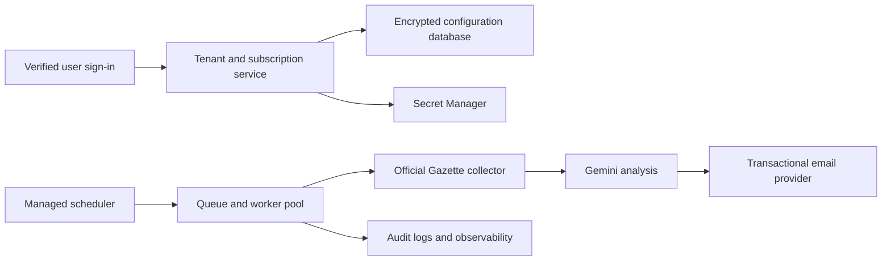

# Commercial architecture

Official Gazette Monitor is production-oriented **single-tenant software**, not a centralized multi-user SaaS backend. The repository provides an Apps Script Edition and a Vercel Private Edition; each installation still has one owner.

## Sellable model supported by this repository

A practical first commercial offering is a managed single-tenant installation:

- Each customer owns a private Apps Script copy.
- The customer authorizes their own Google account.
- Their Gemini key, recipients, quota, state, and triggers remain isolated.
- Onboarding, configuration, updates, and support can be packaged as a service.

This model keeps infrastructure cost low and avoids storing customers' Gmail credentials. It does not provide centralized billing, organization management, or fleet-wide operations.

An alternative managed offering can use the Vercel Private Edition:

- Each customer receives a separate Vercel project and database boundary.
- The dashboard is protected by that customer's administrator credential.
- Customer-entered provider keys are encrypted with an installation-specific key.
- Resend, Gemini, database, and Vercel usage remain attributable to that installation.
- Updates can be delivered through reviewed GitHub releases and controlled database migrations.

This provides stronger hosting, delivery records, and observability than Apps Script, but it is still not shared multi-tenant SaaS. Vercel Pro is the appropriate plan for commercial use and sub-daily native Cron schedules.

## Why a shared Apps Script deployment is unsafe

Script Properties are global to one script project. A shared deployment would mix customer settings and secrets unless the application were redesigned around per-user identity and storage. Even with User Properties, Apps Script remains a poor fit for a paid multi-tenant service because of OAuth verification, per-user authorization, trigger ownership, quotas, subscription enforcement, observability, and operational isolation.

Do not work around this limitation by exposing the dashboard anonymously, placing an access PIN in Script Properties, or using one developer-owned Gemini key for all customers.

## Recommended SaaS phase

A centralized product should introduce:

Minimum production components:

- Verified authentication and per-tenant authorization.
- Encrypted relational storage with tenant-level isolation.
- Managed secret storage and key rotation.
- Durable scheduled jobs and retry queues.
- Transactional email with bounce and complaint handling.
- Usage metering, plans, invoices, and entitlement checks.
- Central logs, metrics, alerting, error tracking, and audit events.
- Terms, privacy notice, retention policy, support process, and incident response.
- Rate, budget, and abuse controls for Gemini and outbound mail.
- Automated deployments, migrations, backups, and rollback.

The Vercel Private Edition supplies an initial hosted control plane, relational state, protected scheduler, and transactional email. A public SaaS must extend it with tenant-aware authentication and authorization, row-level isolation, queues/workflows, verified recipients, bounce handling, billing, and deletion/export workflows. The deterministic parsing, Gemini schema, official-link validation, and report logic can be reused.

## Suggested commercial roadmap

### Phase 1 — Managed self-hosted edition

- Private per-customer installation.
- Branded onboarding and configuration.
- Update and support service.
- No shared customer data.

### Phase 2 — Hosted beta

- Invite-only authentication and tenant-isolated database records.
- One notification channel and simple plans.
- Central monitoring, rate limits, and audit logs.
- Invite-only customers while reliability is measured.

### Phase 3 — General availability

- Verified OAuth consent and legal policies.
- Billing, entitlements, lifecycle emails, and self-service deletion.
- Multiple alert profiles, organization roles, and support tooling.
- Service-level objectives, incident response, backups, and disaster recovery.

## Product disclaimer

Do not market the service as an official government product or guarantee that every applicable vacancy will be identified. The Official Gazette remains the legal source, and both AI and keyword matching require user verification.
