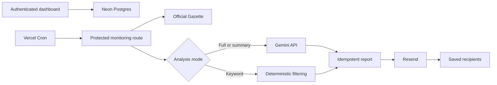

# Vercel Private Edition deployment

This guide deploys a private, single-administrator version of Official Gazette Academic Alerts. It is suitable for a personal hosted installation or a managed single-customer deployment. It is not an open-registration SaaS.

## Architecture



The browser never receives stored API keys. Credentials entered in the dashboard are encrypted with AES-256-GCM before they are written to Postgres. The encryption key remains a Vercel environment variable.

## Platform requirements

- A Vercel account.
- Node.js 22 or newer for local development.
- A Neon Postgres database connected through the [Vercel Marketplace](https://vercel.com/docs/marketplace-storage).
- A Resend account and API key. Production sending requires a domain you control with SPF and DKIM configured; a dedicated subdomain is recommended. See [Resend domains](https://resend.com/docs/dashboard/domains/introduction).
- A Gemini Developer API key only when `Full AI` or `Summary only` mode is selected.

### Vercel plan choice

[Vercel Hobby Cron](https://vercel.com/docs/cron-jobs/usage-and-pricing) can invoke a project only once per day and may run at any point within the configured hour. The Hobby deployment therefore offers a 24-hour monitoring interval.

Native 1, 2, 3, 4, 6, 8, or 12-hour monitoring requires Vercel Pro and the hourly Cron profile. Vercel's paid plan is also the appropriate choice for commercial/business use. Cron delivery can overlap or be duplicated, so the application also uses a database lease and delivery idempotency.

## 1. Import the repository

1. In Vercel, choose **Add New → Project**.
2. Import `yberkayinci/turkish-official-gazette-academic-alerts`.
3. Set **Root Directory** to `apps/vercel`.
4. Keep the detected Next.js build settings.
5. Choose a function region near the database; the included configuration uses Frankfurt when supported.

Every pull request creates a Preview deployment. The configured production branch, normally `main`, creates Production deployments.

## 2. Provision Postgres

Install Neon from the Vercel Marketplace and connect it to the project. Confirm that `DATABASE_URL` is available to Production, Preview, and Development as appropriate.

Use a pooled connection string for runtime requests. Run migrations using the unpooled URL when your provider exposes one:

```bash
cd apps/vercel
npm ci
npm run db:migrate
```

The migration is idempotent and creates the singleton configuration, processed-publication, cache, delivery, lease, activity, and login-throttling tables.

## 3. Configure environment variables

Copy `.env.example` for local development. In Vercel, add secrets under **Project Settings → Environment Variables**. Never prefix secrets with `NEXT_PUBLIC_`.

Required:

| Variable | Purpose |
| --- | --- |
| `DATABASE_URL` | Neon pooled runtime connection string |
| `ADMIN_PASSWORD_HASH` | Scrypt hash used by the private administrator login |
| `SESSION_SECRET` | Signs short-lived, HttpOnly dashboard sessions |
| `APP_ENCRYPTION_KEY` | 32-byte base64 key used to encrypt stored provider credentials |
| `CRON_SECRET` | Authenticates the Vercel Cron request |

Recommended server-managed fallbacks:

| Variable | Purpose |
| --- | --- |
| `RESEND_API_KEY` | Email delivery when no encrypted dashboard key is stored |
| `RESEND_FROM` | Verified default sender, such as `Official Gazette Monitor <alerts@example.com>` |
| `GEMINI_API_KEY` | Optional system Gemini key; dashboard BYOK can replace it |
| `VERCEL_CRON_PROFILE` | Runtime profile that must match the committed static `vercel.json` |

Generate values locally:

```bash
npm run auth:hash-password
npm run secrets:generate
```

Store the printed values directly in Vercel. Do not commit them or paste them into issues, logs, or pull requests. Mark platform secrets as sensitive when the Vercel plan supports that feature.

The password-hash command also prints an escaped `ADMIN_PASSWORD_HASH=...` line for local `.env.local` files. Use the unescaped value in Vercel itself.

## 4. Configure Resend

1. Install Resend from the Vercel Marketplace or create an API key in Resend.
2. Verify a sending domain or dedicated subdomain.
3. Add the generated SPF and DKIM records to DNS; DMARC is also recommended.
4. Add `RESEND_API_KEY` and `RESEND_FROM` to Vercel, or store a replacement key from the authenticated dashboard.
5. Redeploy after changing environment variables.

Resend's shared test sender is for account-owner testing only. A verified domain is required before sending production alerts to arbitrary recipients.

## 5. Choose the Cron profile

Vercel requires every committed Cron entry to contain a concrete `schedule` string. The repository therefore ships a static, daily Hobby configuration in `apps/vercel/vercel.json`; it does not generate the schedule from an environment-variable expression.

For the default Hobby deployment, keep the committed configuration and set:

```text
VERCEL_CRON_PROFILE=hobby
```

The static schedule is `17 7 * * *`, nominally 10:17 in `Europe/Istanbul` (07:17 UTC). Hobby scheduling has hourly precision, so Vercel may invoke it at any point from 10:00 through 10:59 Istanbul time.

For Vercel Pro and sub-daily monitoring, select the tracked hourly template from `apps/vercel`:

```bash
npm run cron:pro
```

Then set:

```text
VERCEL_CRON_PROFILE=pro
```

Review and commit the resulting `vercel.json`, then redeploy. Git-connected Vercel deployments read configuration from the committed repository, so running the selection command locally without committing the changed file does not update production. The Pro schedule is `17 * * * *`; it invokes the protected monitor route at minute 17 of each hour, and the application then enforces the interval and `Europe/Istanbul` active-hours settings saved in the dashboard.

To return to Hobby:

```bash
npm run cron:hobby
```

Set `VERCEL_CRON_PROFILE=hobby`, commit `vercel.json`, and redeploy. `npm run cron:verify` checks that the runtime profile and static schedule agree. The same check runs automatically before a production build, preventing a profile mismatch from being deployed. The canonical templates remain available at `config/vercel.hobby.json` and `config/vercel.pro.json`.

Vercel adds `Authorization: Bearer <CRON_SECRET>` to registered Cron requests. The endpoint fails closed when the secret is missing or incorrect. See [Managing Cron Jobs](https://vercel.com/docs/cron-jobs/manage-cron-jobs).

## 6. Deploy and initialize

1. Deploy the project once environment variables and the database are connected.
2. Run the database migration against the production database before signing in.
3. Open the Vercel URL and sign in with the administrator password.
4. Enter the primary recipient, optional BCC recipients, verified sender, schedule, filters, and analysis mode.
5. Add and test the Gemini key only if AI is enabled.
6. Send a test email.
7. Run **Check now** in Keyword mode first.
8. Enable monitoring only after the health panel reports that storage, email, authentication, and Cron configuration are ready.

## 7. Production verification

Before relying on alerts, verify:

- The deployment can reach `https://www.resmigazete.gov.tr`.
- A future or invalid date is rejected rather than silently mapped to the current issue.
- Regular and supplemental issues are discovered.
- Test mail reaches the primary recipient and additional recipients remain private.
- Two overlapping monitor requests create one effective run and one delivery.
- Gemini failure produces official manual-review links instead of a false negative.
- Oversized or unexpected files are linked for review and are not passed through the browser.
- Cron logs contain no email address, API key, prompt body, PDF body, or database URL.

## Security rules

- Keep application registration disabled; this edition has one administrator.
- Use a unique administrator password and rotate it after suspected disclosure.
- Rotate `SESSION_SECRET`, `APP_ENCRYPTION_KEY`, and `CRON_SECRET` through a documented maintenance window. Rotating the encryption key without re-encrypting stored provider secrets makes them unreadable.
- Allow outbound document fetches only to `https://www.resmigazete.gov.tr`, validate every redirect, cap size and duration, and require the expected content type/PDF signature.
- Treat Gazette content as untrusted data and never follow model-generated instructions or URLs.
- Use the official source documents as the final authority.

See [Security Policy](../SECURITY.md) and [Vercel's environment-variable guidance](https://vercel.com/docs/environment-variables).

## Rollback and recovery

- Vercel can roll back application deployments, but Cron configuration may need an explicit redeploy or manual update after rollback.
- Database migrations must be backward-compatible with the version being rolled back.
- Back up Postgres and test restoration before commercial use.
- A failed email remains eligible for retry; a successful delivery record prevents duplicate mail.
- If monitoring becomes unsafe, disable Cron in Vercel and then investigate the activity log.

## Costs and quotas

Monitor Vercel Function usage, Postgres storage/compute, Resend deliveries, and Gemini tokens independently. The application limits documents and run duration, but provider-side budgets and usage alerts should also be enabled.

Current provider limits can change. Confirm them in the official [Vercel Cron](https://vercel.com/docs/cron-jobs/usage-and-pricing), [Vercel Functions](https://vercel.com/docs/functions/limitations), [Resend](https://resend.com/docs/api-reference/emails/send-email), and [Gemini document-processing](https://ai.google.dev/gemini-api/docs/document-processing) documentation before a paid launch.
